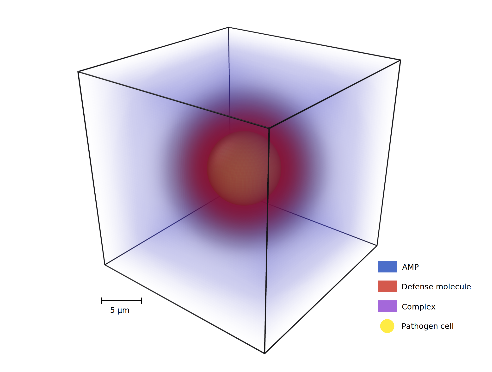

# Spatial Distancing

A computational model framework for simulating molecular interactions between host and pathogen cell.

Yann Bachelot, Anastasia Solomatina, Marc Thilo Figge

Research Group Applied Systems Biology - Head: Prof. Dr. Marc Thilo Figge\
https://www.leibniz-hki.de/en/applied-systems-biology.html \
HKI-Center for Systems Biology of Infection\
Leibniz Institute for Natural Product Research and Infection Biology - Hans Knöll Institute (HKI)\
Adolf-Reichwein-Straße 23, 07745 Jena, Germany

The project code is licensed under BSD 2-Clause.\
See the LICENSE file provided with the code for the full license.

## Project

Welcome to the repository of the hybrid Agent-Based Model (hABM) developed by the **Applied Systems Biology** team of **Leibniz-HKI**.
The main purpose of this framework includes simulating molecules interactions and defense mechanisms of a pathogen cell.
Cells are modeled using an ABM and molecules as PDEs. It is part of a bigger framework, specialized here for the simulation of agent(s) and molecules, in order to study the interactions between pathogen and molecules.

Visual representation of the system. The system is represented as a three-dimensional cube, with the pathogen cell modeled as a sphere centered in the environment. AMP (blue), defensive (red), and complexes (purple) molecules diffuse and interact with each other as well as with the pathogen cell (yellow) in the extracellular space. This is a snapshot (t=0.32s) of an exemplary simulation.
## Requirements

The following software components are required to build and use the ABM framework:

- C++17 (or higher)
- Boost (>= Version 1.56)
- OpenMP (Version 4.5)
- CMake (recommended for build process)

## Getting started
### Build process

To build the framework, clone the repository to a local folder (here: Spatial_distancing_PDE_model/) and use the following commands:

`~/Spatial_distancing_PDE_model$ mkdir build; cd build`

Release or Debug mode:

`~/Spatial_distancing_PDE_model/build$ cmake -DCMAKE_BUILD_TYPE=Release .. `
or `~/Spatial_distancing_PDE_model/build$ cmake -DCMAKE_BUILD_TYPE=Debug .. `

`~/Spatial_distancing_PDE_model/build$ make `

The compiled files can be found in the build/ folder.

### Run test configurations

To test if everything was compiled accordingly, run test configuration (this should take a few seconds):

`~/Spatial_distancing_PDE_model/build$ cd test/`

`~/Spatial_distancing_PDE_model/build/test$ ./test_configurations`

(Test must be executed from the folder)

If the tests pass, the framework and its corresponding libraries were successfully installed.

### Model usage and input

To use the model, run the executable program `build/src/SpatialDistancing` with a `.json` configuration file as program argument

`~/Spatial_distancing_PDE_model build$/src/SpatialDistancing <config-file>.json`

Additional input files
- `analyser-config.json`
- `output-config.json`
- `simulator-config.json`

are located in the folder specified as `config_path` variable in `<config-file>.json`.

The output is written to the folder specified in the `output_path` variable in the `<config-file>.json`.

### Output formats

The output is written to `output_path/results/SIMULATION_FOLDER/` and contains:
- measurements (if activated in `analyser-config.json`)

The main output format for generating data applicable to analytical models is found in `measurements/` folder.

You also have the possibility to generate ".xyz" files for further visualization in software such as _ovito_.

## Configurations

Predefined configurations including test scenarios can be found in the `configurations/` folder.

For the study on conSDM with AMP simulated as an one-time treatment:
Config folder `configurations/conSDM` and config file `config.json`

## General structure
The framework is structured as followed:

- **configurations**: configuration folders including `.json`files that define single scenarios
- **src**: source `.cpp` and header `.h` files of the framework
- **test**: test scenarios and unit tests using doctest library
- **cmake**: CMake specific files
